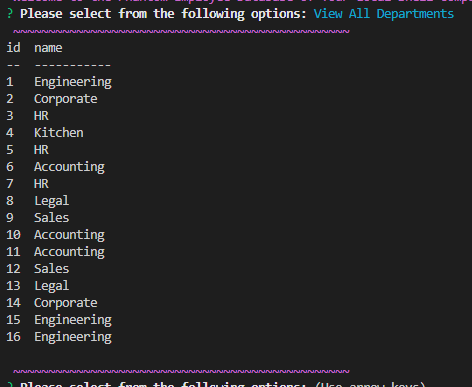
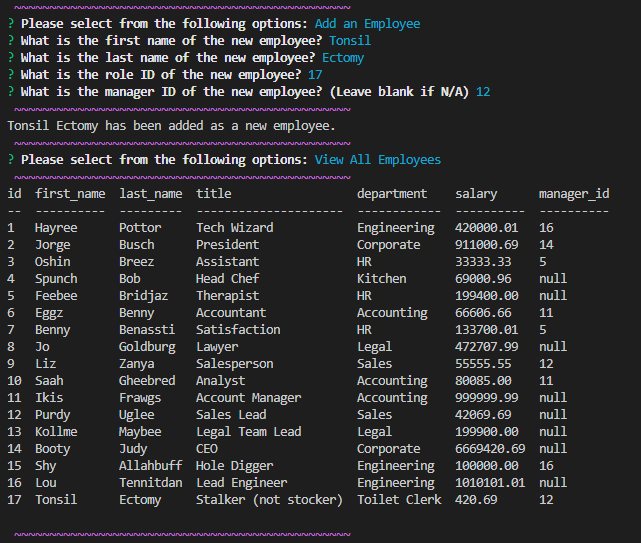
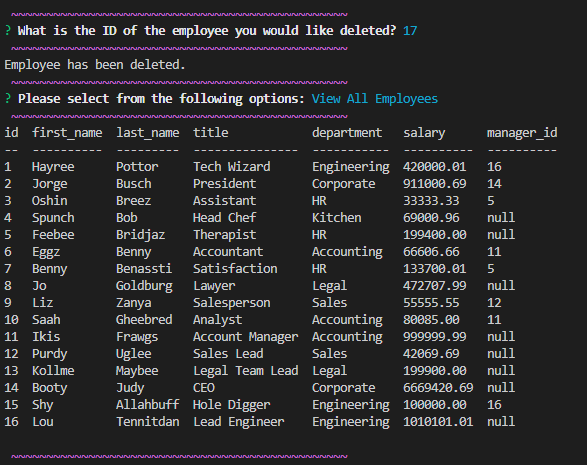

# ghost-in-the-shell-company
  [](https://opensource.org/licenses/MIT)


  A way to store definitely real people working for a definitely real company in a database. Phantom employees, their roles, and departments may be viewed, entered, updated, or a specific employee may be deleted from the database.
  ## Table of Contents:
  * [Installation](#installation)
  * [Usage](#usage)
  * [License](#license)
  * [Contributing](#contributing)
  * [Tests](#tests)
  * [Questions](#questions)
  ## Installation:
  To install the dependencies needed, open the console and run:
  npm i

  To create the database- in the console - login to mysql and run: 
  source schema.sql

  To seed the database- in the console - run:
  source seeds.sql

  ## Usage:
  Instructional video on how the application works:
  https://drive.google.com/file/d/1T_nMkLjWN7O-Uy_BdxJjyTCEhzn-Peaz/view

  To start the application- open server.js in integrated terminal and type in the command line: npm start

  ```md
  GIVEN a command-line application that accepts user input

  WHEN I start the application
  THEN I am presented with the following options: view all departments, view all roles, view all employees, add a department, add a role, add an employee, and update an employee role
  ```
  
  ```md
  WHEN I choose to view all departments
  THEN I am presented with a formatted table showing department names and department ids
  ```
  
  ```md
  WHEN I choose to view all roles
  THEN I am presented with the job title, role id, the department that role belongs to, and the salary for that role
  ```
  
  ```md
  WHEN I choose to view all employees
  THEN I am presented with a formatted table showing employee data, including employee ids, first names, last names, job titles, departments, salaries, and managers that the employees report to
  ```
  
  ```md
  WHEN I choose to add a department
  THEN I am prompted to enter the name of the department and that department is added to the database
  ```
  
  ```md
  WHEN I choose to add a role
  THEN I am prompted to enter the name, salary, and department for the role and that role is added to the database
  ```
  
  ```md
  WHEN I choose to add an employee
  THEN I am prompted to enter the employee’s first name, last name, role, and manager, and that employee is added to the database
  ```
  
  ```md
  WHEN I choose to update an employee role
  THEN I am prompted to select an employee to update and their new role and this information is updated in the database 
  ```
  
  ```md
  WHEN I choose to delete an employee
  THEN I am promted to enter an employee's ID to delete and this employee is deleted from the database
  ```
  


  ## License:
  The MIT License (MIT)

      Copyright (c) undefined undefined
      
      Permission is hereby granted, free of charge, to any person obtaining a copy of this software and associated documentation files (the "Software"), to deal in the Software without restriction, including without limitation the rights to use, copy, modify, merge, publish, distribute, sublicense, and/or sell copies of the Software, and to permit persons to whom the Software is furnished to do so, subject to the following conditions:
      
      The above copyright notice and this permission notice shall be included in all copies or substantial portions of the Software.
      
      THE SOFTWARE IS PROVIDED "AS IS", WITHOUT WARRANTY OF ANY KIND, EXPRESS OR IMPLIED, INCLUDING BUT NOT LIMITED TO THE WARRANTIES OF MERCHANTABILITY, FITNESS FOR A PARTICULAR PURPOSE AND NONINFRINGEMENT. IN NO EVENT SHALL THE AUTHORS OR COPYRIGHT HOLDERS BE LIABLE FOR ANY CLAIM, DAMAGES OR OTHER LIABILITY, WHETHER IN AN ACTION OF CONTRACT, TORT OR OTHERWISE, ARISING FROM, OUT OF OR IN CONNECTION WITH THE SOFTWARE OR THE USE OR OTHER DEALINGS IN THE SOFTWARE.
  ## Contributing:
  N/A
  ## Tests:
  N/A
  ## Questions:
  If you have questions, you may contact me on [GitHub](https://github.com/d-lil) or you may reach out by contacting Daniel Liljegren at dahneel@gmail.com

